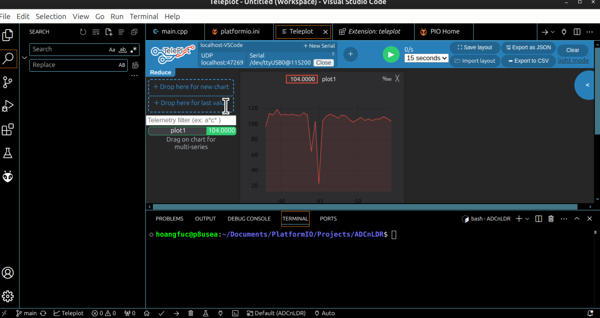

- This project use a LDR connect to an ADC pin - it is pin 34 in this case - for analog value reading. 
- The 3V3 pin connect to LDR with the path straight to GND,  furthermore a resistor stands in the way for voltage spliting.
- The script runs like:
 + In case of low intensity, the LDR acts highly like a normal resistor; make it harder for electron to flows straight to GND, rather than flow in other split path. 
 Analog value read would be small due to the distribution of current flow.
 + In case of high intensity, the LDR acts vice versa as if the path to ADC pin due to the lower resistant.
 

