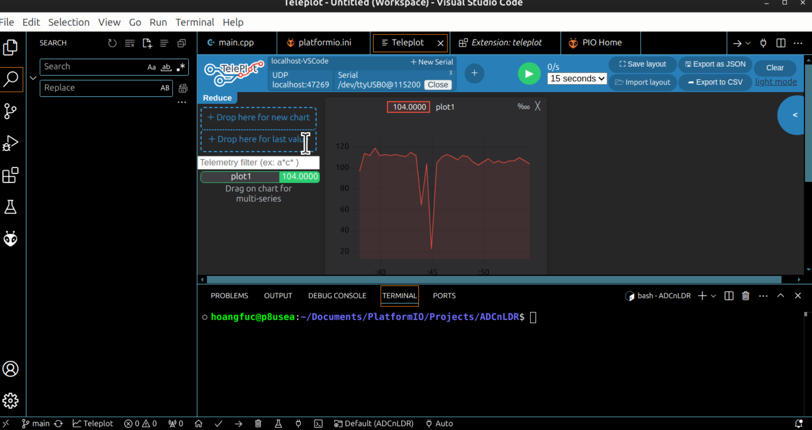

- This project uses an LDR connected to an ADC pin - it is pin 34 in this case - for analog value reading.
- The 3V3 pin connects to LDR with the path straight to GND, furthermore, a resistor stands in the way of one-way flowing.
- The script runs like this:
	+ In case of low light intensity, the LDR acts highly like a normal resistor; making it harder for current to flow straight to GND The analog value read would be small due to the lack of current flow.
	+ In case of high light intensity, the LDR acts vice versa as if the path to the ADC pin is due to the lower resistance, rather than flow in another split path.
 

